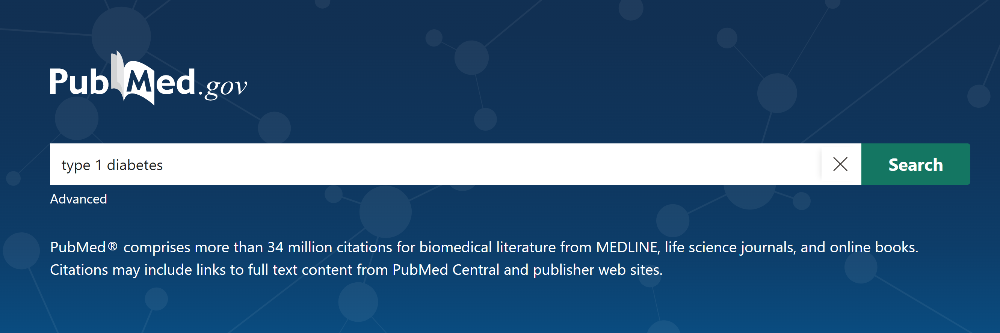
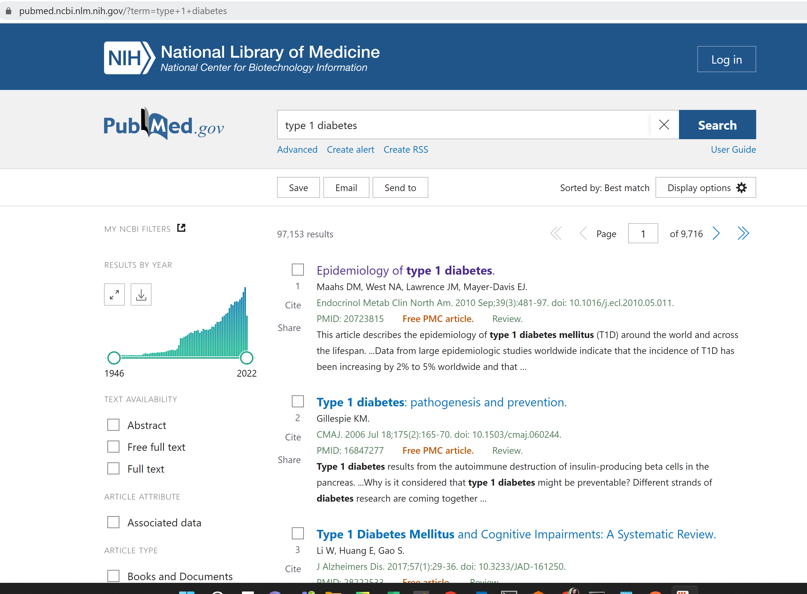
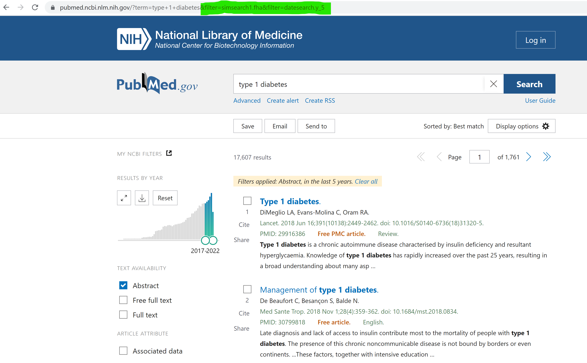
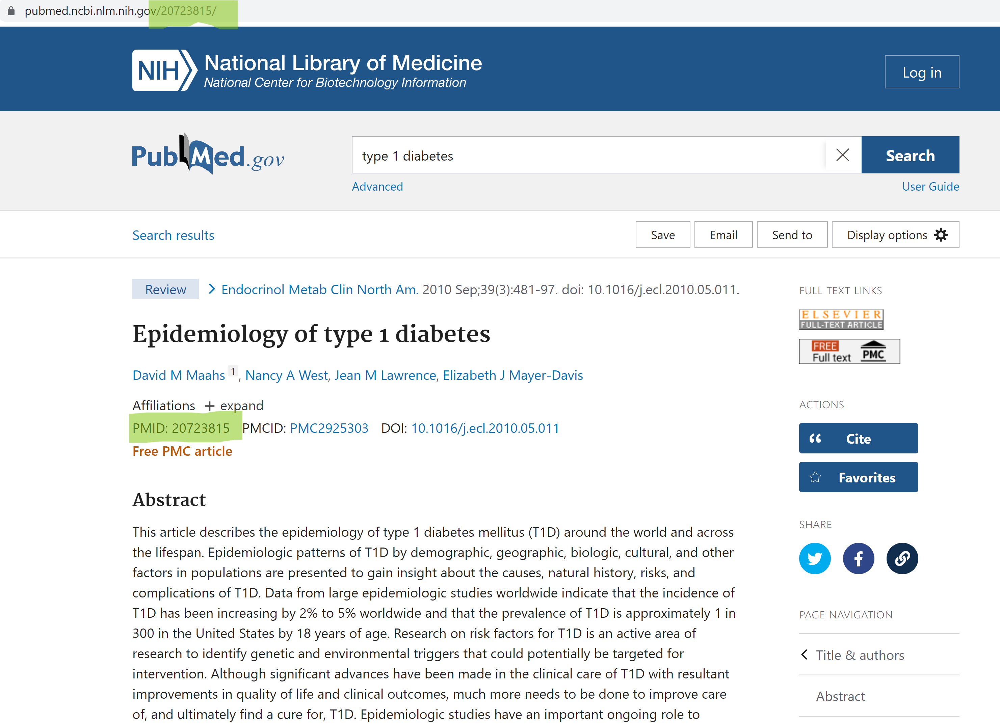
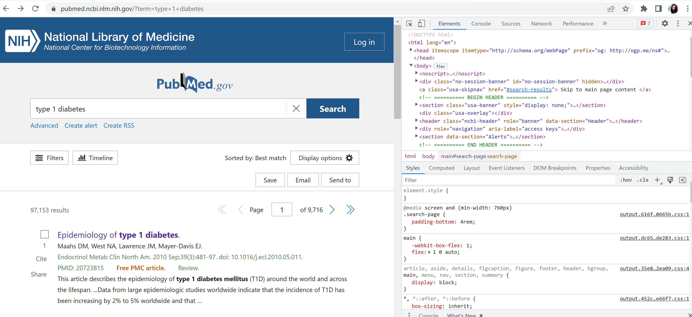
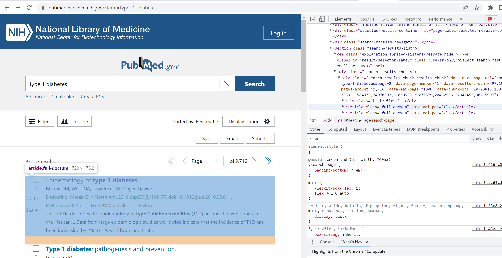
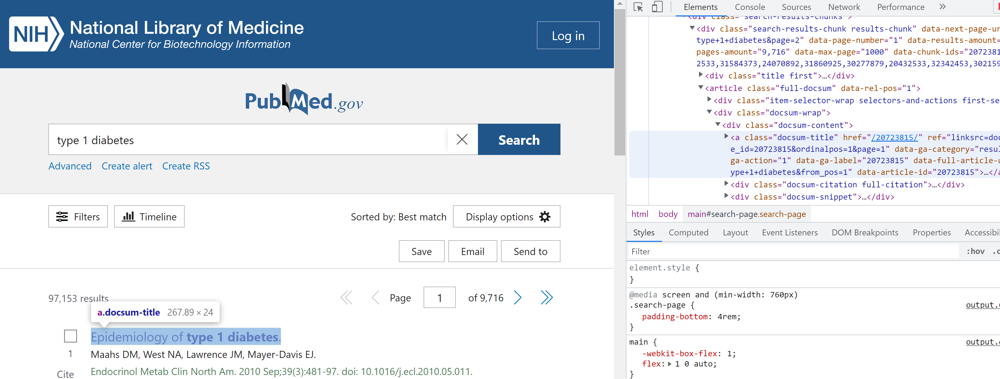

# Web Scraping

Web scraping, web harvesting, or web data extraction is data scraping used for extracting data from websites. Web scraping software may directly access the World Wide Web using the Hypertext Transfer Protocol or a web browser. While web scraping can be done manually by a software user, the term typically refers to automated processes implemented using a bot or web crawler. It is a form of copying in which specific data is gathered and copied from the web, typically into a central local database or spreadsheet, for later retrieval or analysis.

Scraping a web page involves fetching it and extracting from it. Fetching is the downloading of a page (which a browser does when a user views a page). Therefore, web crawling is a main component of web scraping, to fetch pages for later processing. Once fetched, extraction can take place. The content of a page may be parsed, searched and reformatted, and its data copied into a spreadsheet or loaded into a database. Web scrapers typically take something out of a page, to make use of it for another purpose somewhere else. An example would be finding and copying names and telephone numbers, companies and their URLs, or e-mail addresses to a list (contact scraping).

[Reference](https://en.wikipedia.org/wiki/Web_scraping)

As a data scientist, I often face issues with client-provided datasets; they are usually **poor**, both in terms of **quantity** and **quality** (meaning classes distribution, variety). Being able to scrape from web can help in augment data support, hence improve models performances.

Here I want to scrape abstracts from [PubMed](https://pubmed.ncbi.nlm.nih.gov/), specifically from paper treating not-so-funny auto-immune diseases:
+ Lupus
+ Type 1 Diabetes
+ Rheumatoid Arthritis
+ Psoriasis
+ Hashimoto's tyroiditis
+ Multiple Sclerosis


### How it works
Web Scraping programs basically simulate browser-like research; go to the chosen webpage and type a sample search. Here I start with Type 1 Diabetes, being a T1D myself.



You can see how the search bar adapted to specific query:
**https://pubmed.ncbi.nlm.nih.gov/?term=type+1+diabetes**

The research leads you to the listing page, where top 10 related results are shown. This webpage is structured to show 10 results per page; this number is arbitrary, can space from units to hundreds, depending on the website you are scraping.



If you flag/set filters or change page, these actions will reflect on to url:


By clicking to one of those links, you are redirected to the abstract page. As you can see, the barsearch redirects you to the article numeric id (PMID).



This is exactly the content we are looking for. But how is it possible to get the PMID and gather the information displayed?

Let's start from reaching the listing page for Type 1 Diabetes.


```python
from bs4 import BeautifulSoup
import requests
import json
import pandas as pd
import time
import re
```


```python
page_url = 'https://pubmed.ncbi.nlm.nih.gov/?term=type+1+diabetes'
request = requests.get(page_url)
soup = BeautifulSoup(request.content, "html.parser")
```


```python
print(str(soup)[:200])
```

    <!DOCTYPE html>
    
    <html lang="en">
    <head itemscope="" itemtype="http://schema.org/WebPage" prefix="og: http://ogp.me/ns#">
    <meta charset="utf-8"/>
    <meta content="IE=edge" http-equiv="X-UA-Compatible"/>
    

**soup** represents exactly what **inspect page** contains:


Now, by navigating the inspect via browser, you can look for html element containing single paper PMID.
By scrolling and opening nested elements in the inspect page on the right side of the page, you can see the corrisponding element highlighted on the left. Each article in the listing page corresponds to an element of 
+ type = "article" 
+ class = "full-docsum"

We expect the listing page to contain a list of 10 classes like this (one for each listed article)
   



Again, by opening all nested html elements in it, we get to know that the PMID is stored as element of
+ type = "a"
+ class = "docsum-title"
+ key = "data-article-id"



Now that we know how the page is structured, we can programmatically
1. compose listing page urls for all auto-immune diseases in scope; we want the latest 100 articles for each disease
2. list all articles urls
3. collect abstracts and store them in a structured dataframe for further use  

### 1. COMPOSE LISTING PAGE URLS


```python
disease_list = ['Lupus',
'Type 1 Diabetes',
'Rheumatoid Arthritis',
'Psoriasis',
"Hashimoto tyroiditis",
'Multiple Sclerosis',
]

pagination = 10
total_per_disease = 100
pages = 100 // 10
```


```python
listing_page_dict = {}
listing_page_url_template = 'https://pubmed.ncbi.nlm.nih.gov/?term={}&sort=date'

for disease in disease_list:
    
    disease = disease.lower()
    disease = disease.replace(' ', '+')
    if disease not in listing_page_dict:
        listing_page_dict[disease] = []
        
    for page in range(pages):
        disease_page_url = listing_page_url_template.format(disease, page)
        if page > 0:
            disease_page_url = disease_page_url + f'&page={page}'
        listing_page_dict[disease].append(disease_page_url)
    print(f"Disease {disease}, Number of pages: {len(listing_page_dict[disease])}")

```

    Disease lupus, Number of pages: 10
    Disease type+1+diabetes, Number of pages: 10
    Disease rheumatoid+arthritis, Number of pages: 10
    Disease psoriasis, Number of pages: 10
    Disease hashimoto+tyroiditis, Number of pages: 10
    Disease multiple+sclerosis, Number of pages: 10
    

### 2. LIST ALL ARTICLES 


```python
articles_by_disease = {}

for disease, disease_url_list in listing_page_dict.items():
    if disease not in articles_by_disease:
        articles_by_disease[disease] = []
    
    for link in disease_url_list:
        request = requests.get(link)
        soup = BeautifulSoup(request.content, "html.parser")
        articles = soup.find_all('a', class_='docsum-title')
        for article in articles:
            pmid = article['data-article-id']
            article_link = f'https://pubmed.ncbi.nlm.nih.gov/{pmid}/'
            articles_by_disease[disease].append(article_link)
            # Here I put some time sleep in order not to overflow PubMed page with too many requests.
            # This might seem like a ddos attack, leading to be banned from the page for good.
            time.sleep(3)

    print(f"Disease {disease}, Number of articles: {len(articles_by_disease[disease])}")
```

    Disease lupus, Number of articles: 100
    Disease type+1+diabetes, Number of articles: 100
    Disease rheumatoid+arthritis, Number of articles: 100
    Disease psoriasis, Number of articles: 100
    Disease hashimoto+tyroiditis, Number of articles: 100
    Disease multiple+sclerosis, Number of articles: 100
    

### 3. GET SINGLE ARTICLES AND STORE IN DATAFRAME


```python
def postprocess_text(text):
    """
    Removes redundant spaces and newlines.
    ========
    Args:
    ========
        text (str): raw text scraped
        
    ========
    Returns:
    ========
        text (str): clean text
    """
    text = re.sub('\n', ' ', text)
    text = re.sub('\s+', ' ', text)
    text = text.strip()
    return text
    
```


```python
archive = []
for disease, articles in articles_by_disease.items():
    print(disease)
    for article_url in articles:
        try:
            request = requests.get(article_url)
            soup = BeautifulSoup(request.content, "html.parser")
        
            # title
            title = soup.find('h1', class_='heading-title').text
            title = postprocess_text(title)

            # abstract
            abstract = soup.find('div', class_='abstract-content selected').text
            abstract = postprocess_text(abstract)

            archive.append({'disease': disease, 'title': title, 'abstract': abstract})
        except Exception as e:
            print(article_url)

        time.sleep(2)

archive = pd.DataFrame(archive)
archive
```

    lupus
    https://pubmed.ncbi.nlm.nih.gov/35908996/
    https://pubmed.ncbi.nlm.nih.gov/35905996/
    https://pubmed.ncbi.nlm.nih.gov/35904552/
    https://pubmed.ncbi.nlm.nih.gov/35904550/
    https://pubmed.ncbi.nlm.nih.gov/35902272/
    https://pubmed.ncbi.nlm.nih.gov/35898669/
    https://pubmed.ncbi.nlm.nih.gov/35894061/
    https://pubmed.ncbi.nlm.nih.gov/35892028/
    https://pubmed.ncbi.nlm.nih.gov/35883223/
    type+1+diabetes
    https://pubmed.ncbi.nlm.nih.gov/35900757/
    https://pubmed.ncbi.nlm.nih.gov/35895064/
    https://pubmed.ncbi.nlm.nih.gov/35877140/
    rheumatoid+arthritis
    https://pubmed.ncbi.nlm.nih.gov/35912809/
    https://pubmed.ncbi.nlm.nih.gov/35912809/
    https://pubmed.ncbi.nlm.nih.gov/35905285/
    https://pubmed.ncbi.nlm.nih.gov/35900187/
    https://pubmed.ncbi.nlm.nih.gov/35894069/
    psoriasis
    https://pubmed.ncbi.nlm.nih.gov/35909403/
    https://pubmed.ncbi.nlm.nih.gov/35904019/
    https://pubmed.ncbi.nlm.nih.gov/35899602/
    https://pubmed.ncbi.nlm.nih.gov/35895852/
    https://pubmed.ncbi.nlm.nih.gov/35895019/
    https://pubmed.ncbi.nlm.nih.gov/35881095/
    https://pubmed.ncbi.nlm.nih.gov/35881094/
    https://pubmed.ncbi.nlm.nih.gov/35876178/
    https://pubmed.ncbi.nlm.nih.gov/35874906/
    https://pubmed.ncbi.nlm.nih.gov/35869524/
    https://pubmed.ncbi.nlm.nih.gov/35868545/
    https://pubmed.ncbi.nlm.nih.gov/35867958/
    https://pubmed.ncbi.nlm.nih.gov/35866919/
    hashimoto+tyroiditis
    https://pubmed.ncbi.nlm.nih.gov/35894674/
    https://pubmed.ncbi.nlm.nih.gov/35821549/
    multiple+sclerosis
    https://pubmed.ncbi.nlm.nih.gov/35915445/
    https://pubmed.ncbi.nlm.nih.gov/35915163/
    https://pubmed.ncbi.nlm.nih.gov/35913607/
    https://pubmed.ncbi.nlm.nih.gov/35915445/
    https://pubmed.ncbi.nlm.nih.gov/35915163/
    https://pubmed.ncbi.nlm.nih.gov/35913607/
    https://pubmed.ncbi.nlm.nih.gov/35901659/
    https://pubmed.ncbi.nlm.nih.gov/35899485/
    


<div>
<style scoped>
    .dataframe tbody tr th:only-of-type {
        vertical-align: middle;
    }

    .dataframe tbody tr th {
        vertical-align: top;
    }

    .dataframe thead th {
        text-align: right;
    }
</style>
<table border="1" class="dataframe">
  <thead>
    <tr style="text-align: right;">
      <th></th>
      <th>disease</th>
      <th>title</th>
      <th>abstract</th>
    </tr>
  </thead>
  <tbody>
    <tr>
      <th>0</th>
      <td>lupus</td>
      <td>Endometriosis and Systemic Lupus Erythematosus...</td>
      <td>Endometriosis is a chronic gynaecological cond...</td>
    </tr>
    <tr>
      <th>1</th>
      <td>lupus</td>
      <td>Peroxisome proliferator activated receptor-γ a...</td>
      <td>Objectives: Premature cardiovascular events in...</td>
    </tr>
    <tr>
      <th>2</th>
      <td>lupus</td>
      <td>Patient and healthcare team recommended medica...</td>
      <td>Objective: Patients identified as black and fr...</td>
    </tr>
    <tr>
      <th>3</th>
      <td>lupus</td>
      <td>Trajectory of Damage Accrual in Systemic Lupus...</td>
      <td>Objective: The Systemic Lupus International Co...</td>
    </tr>
    <tr>
      <th>4</th>
      <td>lupus</td>
      <td>Timing and Predictors of Incident Cardiovascul...</td>
      <td>Objective: Systemic lupus erythematosus (SLE) ...</td>
    </tr>
    <tr>
      <th>...</th>
      <td>...</td>
      <td>...</td>
      <td>...</td>
    </tr>
    <tr>
      <th>555</th>
      <td>multiple+sclerosis</td>
      <td>Safety, immunogenicity, efficacy, and acceptab...</td>
      <td>In the last two years, a new severe acute resp...</td>
    </tr>
    <tr>
      <th>556</th>
      <td>multiple+sclerosis</td>
      <td>Microglia depletion as a therapeutic strategy:...</td>
      <td>Multiple sclerosis is a chronic central nervou...</td>
    </tr>
    <tr>
      <th>557</th>
      <td>multiple+sclerosis</td>
      <td>Positive effect of immunomodulatory therapies ...</td>
      <td>Background: The role of neuroinflammation and ...</td>
    </tr>
    <tr>
      <th>558</th>
      <td>multiple+sclerosis</td>
      <td>Voice Analysis for Neurological Disorder Recog...</td>
      <td>Quantifying neurological disorders from voice ...</td>
    </tr>
    <tr>
      <th>559</th>
      <td>multiple+sclerosis</td>
      <td>Upper Limb Sensory-Motor Control During Exposu...</td>
      <td>Multiple sclerosis (MS) is an autoimmune and n...</td>
    </tr>
  </tbody>
</table>
<p>560 rows × 3 columns</p>
</div>


```python

```
