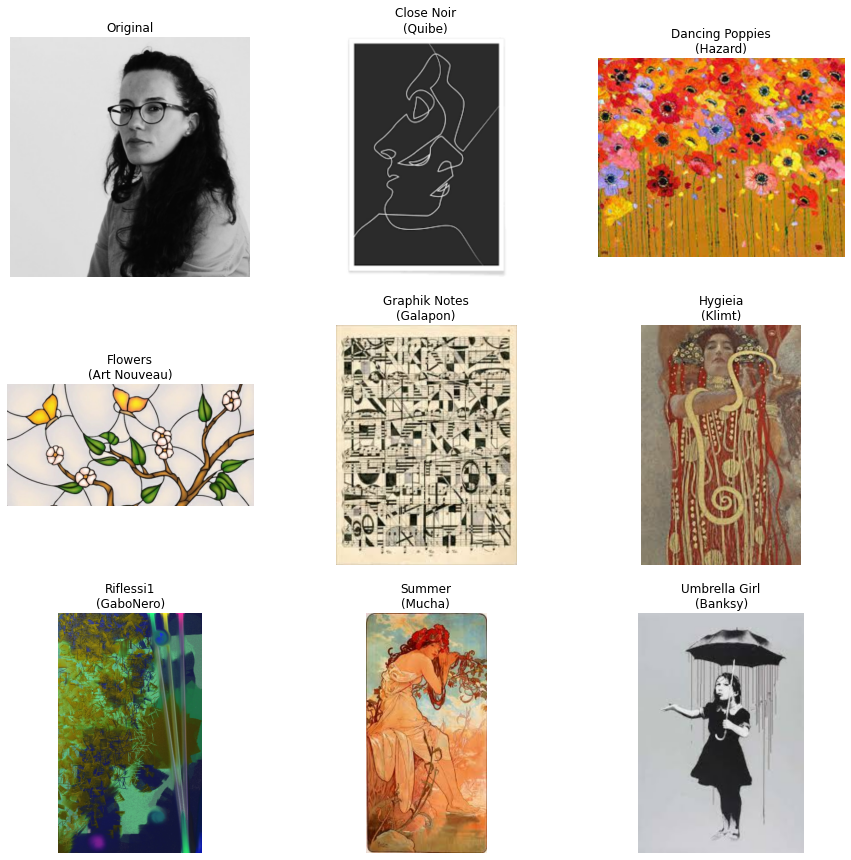
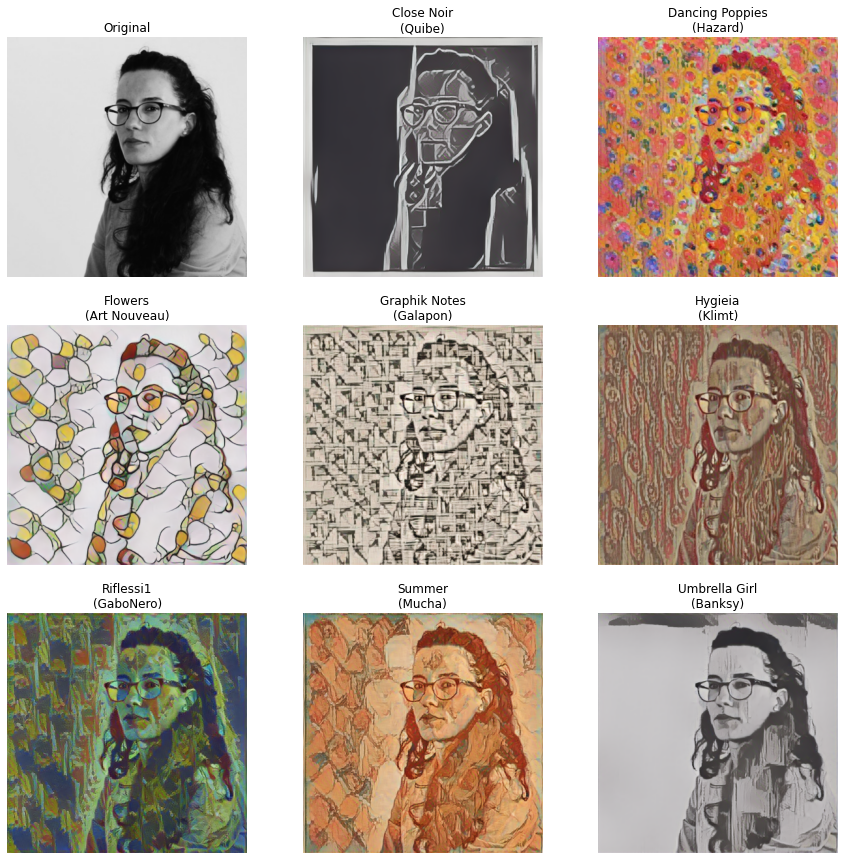
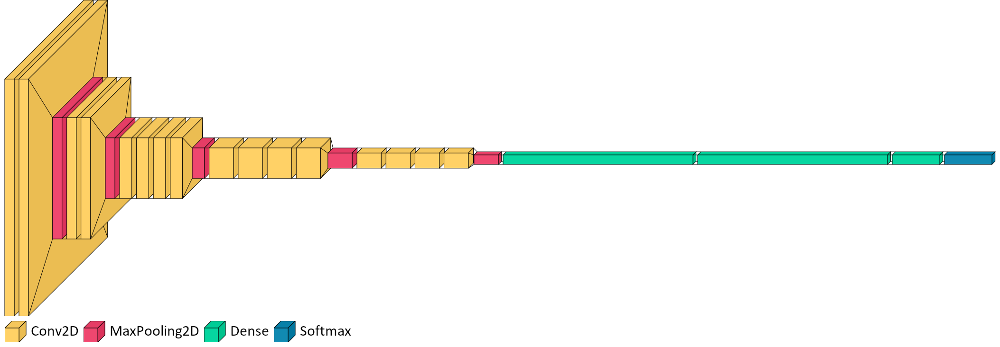
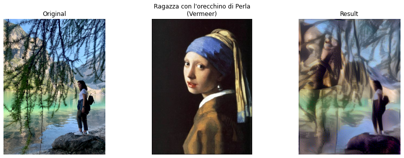

# Neural Style Transfer

Style transfer consists in generating an image with the same "content" as a base image, but with the "style" of a different picture (typically artistic). The output image looks like the content image but painted in the reference style. This is achieved through the optimization of a loss function that has 3 components: **style loss**, **content loss**, and **total variation loss**:

+ The **total variation loss** imposes local spatial continuity between the pixels of the combination image, giving it visual coherence.

+ The **style loss** is where the deep learning keeps in --that one is defined using a deep convolutional neural network. Precisely, it consists in a sum of L2 distances between the Gram matrices of the representations of the base image and the style reference image, extracted from different layers of a convnet (trained on ImageNet). The general idea is to capture color/texture information at different spatial scales (fairly large scales --defined by the depth of the layer considered).

+ The **content loss** is a L2 distance between the features of the base image (extracted from a deep layer) and the features of the combination image, keeping the generated image close enough to the original one.

[Reference](https://arxiv.org/abs/1508.06576)

By following this notebook, you will be able to:
1. apply a **pretrained** neural network to custom content-style couples of images
2. **train** your own custom model on your favourite content-style couple of images

## Installation & Setup

In order to execute the current notebook, you need to install the following dependencies:
```
jupyter==1.0.0
keras==2.9.0
matplotlib==3.5.2
numpy==1.23.1
scikit-image==0.19.3
tensorflow==2.9.1
tensorflow-hub==0.12.0
visualkeras==0.0.2
```

## 1. Pretrained Neural Network
Following [this](https://www.tensorflow.org/tutorials/generative/style_transfer#import_and_configure_modules) tutorial from `tensorflow`


```python
import os
import time
import functools
from glob import glob

import numpy as np
import matplotlib as mpl
import matplotlib.pyplot as plt
import tensorflow as tf
import tensorflow_hub as hub
from skimage import io, color

# Load compressed models from tensorflow_hub
os.environ['TFHUB_MODEL_LOAD_FORMAT'] = 'COMPRESSED'

mpl.rcParams['figure.figsize'] = (12, 12)
mpl.rcParams['axes.grid'] = False
```

### Utils


```python
def load_img(path_to_img):
    '''
    Read image, set to 3 channels (rgb), cast values to float32, resize.
    
    ========
    Args: 
    ========
        path_to_img (str): path to the image to be read
    
    ========
    Returns:
    ========
        img (tf.image): array of shape (1, rows, columns, 3)
    '''
    max_dim = 512
    img = tf.io.read_file(path_to_img)
    img = tf.image.decode_image(img, channels=3)
    img = tf.image.convert_image_dtype(img, tf.float32)

    shape = tf.cast(tf.shape(img)[:-1], tf.float32)
    long_dim = max(shape)
    scale = max_dim / long_dim

    new_shape = tf.cast(shape * scale, tf.int32)

    img = tf.image.resize(img, new_shape)
    img = img[tf.newaxis, :]
    return img
```


```python
def show_image(img, cmap=None):
    '''
    Process a tf.image, squeeze dimension 0 reducing to three-dimension image,
    shows image, with cmap if explicit.
    
    ========
    Args:
    ========
        img (tf.image): either content or style image
        cmap (string): colormap to show the image with
        
    ========
    Returns:
    ========
        None
    '''
    if len(img.shape) > 3:
        img = tf.squeeze(img, axis=0)
    plt.imshow(img, cmap=cmap)
```


```python
def tensor_to_image(tensor):
    '''
    Transorm a tensor to an image to be displayed.
    
    ========
    Args:
    ========
        tensor (tf.tensor): tensor to be transformed into three-dimension image
    
    ========
    Returns:
    ========
        image (array): image
    '''
    tensor = tensor*255
    image = np.array(tensor, dtype=np.uint8)
    if np.ndim(image)>3:
        assert image.shape[0] == 1
        image = image[0]
    return image
```


```python
def apply_style(content_image, style_image, hub_model):
    '''
    Applies style image to content image.
    
    ========
    Args:
    ========
        content_image (tf.image): image to be transformed
        style_image (tf.image): style to be applied
        hub_model: pretrained neural network
        
    ========
    Returns:
    ========
        stylezed_image (tf.image): neural network outcome
    '''
    stylized_image = hub_model(tf.constant(content_image), tf.constant(style_image))[0]
    stylized_image = tensor_to_image(stylized_image)
    return stylized_image
```


```python
def get_title(style_file):
    '''
    Get style picture title from filename.
    
    ========
    Args:
    ========
        style_file (string): path to style image
    
    ========
    Returns:
    ========
        title (string): style image title
    '''    
    title = os.path.basename(style_file)
    title = os.path.splitext(title)[0]
    title, artist = title.split('by')
    title = title.replace('_', ' ').strip()
    artist = artist.replace('_', ' ').strip()
    title = f'{title}\n({artist})'
    return title
```

### Load the pretrained model


```python
hub_model = hub.load('https://tfhub.dev/google/magenta/arbitrary-image-stylization-v1-256/2')
```

### Load content and style images
The styles folder contains 8 of my favourite pieces of art; the content image is one of mine (quite narcissistic, you might think; well yes, I do agree, but I need a brand new profile picture for this portfolio and I am definitely not a selfie kind of person).


```python
content_image = load_img("profile_image.jpg")

fig = plt.figure(figsize=(15,15))
ax = plt.subplot(3,3,1)
ax.set_title("Original")
ax.axis('off')
show_image(content_image)

style_files = sorted(glob('styles/*'))
for i, style_file in enumerate(style_files):
    style_image = load_img(style_file)
    
    ax = plt.subplot(3,3,i+2)
    title = get_title(style_file)
    ax.set_title(title)
    ax.axis('off')
    show_image(style_image)
    
```


    

    


### Apply transformations


```python
plt.figure(figsize=(15,15))
ax = plt.subplot(3,3,1)
ax.set_title("Original")
ax.axis('off')
show_image(content_image)

for i, style_file in enumerate(style_files):
    style_image = load_img(style_file)
    stylized_image = apply_style(content_image, style_image, hub_model)
    
    ax = plt.subplot(3,3,i+2)
    title = get_title(style_file)
    ax.set_title(title)
    ax.axis('off')
    show_image(stylized_image)

```


    

    


## 2. Train your own neural network
Let's say you are not satisfied with the result and/or wish to train your own model.

First of all, what kind of model does the trick? As accurately detailed in the [original paper](https://arxiv.org/pdf/1508.06576.pdf), Neural Style Transfer relies on **Convolutional Neural Networks**; [VGG19](https://iq.opengenus.org/vgg19-architecture/) is a well-known model CNN.

### VGG19

VGG19 is a variant of VGG model which in short consists of 19 layers (16 convolution layers, 3 Fully connected layer, 5 MaxPool layers and 1 SoftMax layer). There are other variants of VGG like VGG11, VGG16 and others.

VGG19 is built as follows:

1. Conv3x3 (64)
2. Conv3x3 (64)
+ MaxPool
3. Conv3x3 (128)
4. Conv3x3 (128)
+ MaxPool
5. Conv3x3 (256)
6. Conv3x3 (256)
7. Conv3x3 (256)
8. Conv3x3 (256)
+ MaxPool
9. Conv3x3 (512)
10. Conv3x3 (512)
11. Conv3x3 (512)
12. Conv3x3 (512)
+ MaxPool
13. Conv3x3 (512)
14. Conv3x3 (512)
15. Conv3x3 (512)
26. Conv3x3 (512)
+ MaxPool
17. Fully Connected (4096)
18. Fully Connected (4096)
19. Fully Connected (1000)
+ SoftMax

### Build & Visualize
It is surprisingly easy to build and visualize the VGG19 network with Keras:


```python
from tensorflow.keras import layers, models

model = models.Sequential()

model.add(layers.Input((512, 512, 3)))

model.add(layers.Conv2D(64, (3, 3), activation='relu', padding='same'))
model.add(layers.Conv2D(64, (3, 3), activation='relu', padding='same'))

model.add(layers.MaxPooling2D((2, 2)))

model.add(layers.Conv2D(128, (3, 3), activation='relu', padding='same'))
model.add(layers.Conv2D(128, (3, 3), activation='relu', padding='same'))

model.add(layers.MaxPooling2D((2, 2)))

model.add(layers.Conv2D(256, (3, 3), activation='relu', padding='same'))
model.add(layers.Conv2D(256, (3, 3), activation='relu', padding='same'))
model.add(layers.Conv2D(256, (3, 3), activation='relu', padding='same'))
model.add(layers.Conv2D(256, (3, 3), activation='relu', padding='same'))

model.add(layers.MaxPooling2D((2, 2)))

model.add(layers.Conv2D(512, (3, 3), activation='relu', padding='same'))
model.add(layers.Conv2D(512, (3, 3), activation='relu', padding='same'))
model.add(layers.Conv2D(512, (3, 3), activation='relu', padding='same'))
model.add(layers.Conv2D(512, (3, 3), activation='relu', padding='same'))

model.add(layers.MaxPooling2D((2, 2)))

model.add(layers.Conv2D(512, (3, 3), activation='relu', padding='same'))
model.add(layers.Conv2D(512, (3, 3), activation='relu', padding='same'))
model.add(layers.Conv2D(512, (3, 3), activation='relu', padding='same'))
model.add(layers.Conv2D(512, (3, 3), activation='relu', padding='same'))

model.add(layers.MaxPooling2D((2, 2)))

model.add(layers.Dense(4096))
model.add(layers.Dense(4096))
model.add(layers.Dense(1000))

model.add(layers.Softmax())

print(model.summary())
```

    Model: "sequential"
    _________________________________________________________________
     Layer (type)                Output Shape              Param #   
    =================================================================
     conv2d (Conv2D)             (None, 512, 512, 64)      1792      
                                                                     
     conv2d_1 (Conv2D)           (None, 512, 512, 64)      36928     
                                                                     
     max_pooling2d (MaxPooling2D  (None, 256, 256, 64)     0         
     )                                                               
                                                                     
     conv2d_2 (Conv2D)           (None, 256, 256, 128)     73856     
                                                                     
     conv2d_3 (Conv2D)           (None, 256, 256, 128)     147584    
                                                                     
     max_pooling2d_1 (MaxPooling  (None, 128, 128, 128)    0         
     2D)                                                             
                                                                     
     conv2d_4 (Conv2D)           (None, 128, 128, 256)     295168    
                                                                     
     conv2d_5 (Conv2D)           (None, 128, 128, 256)     590080    
                                                                     
     conv2d_6 (Conv2D)           (None, 128, 128, 256)     590080    
                                                                     
     conv2d_7 (Conv2D)           (None, 128, 128, 256)     590080    
                                                                     
     max_pooling2d_2 (MaxPooling  (None, 64, 64, 256)      0         
     2D)                                                             
                                                                     
     conv2d_8 (Conv2D)           (None, 64, 64, 512)       1180160   
                                                                     
     conv2d_9 (Conv2D)           (None, 64, 64, 512)       2359808   
                                                                     
     conv2d_10 (Conv2D)          (None, 64, 64, 512)       2359808   
                                                                     
     conv2d_11 (Conv2D)          (None, 64, 64, 512)       2359808   
                                                                     
     max_pooling2d_3 (MaxPooling  (None, 32, 32, 512)      0         
     2D)                                                             
                                                                     
     conv2d_12 (Conv2D)          (None, 32, 32, 512)       2359808   
                                                                     
     conv2d_13 (Conv2D)          (None, 32, 32, 512)       2359808   
                                                                     
     conv2d_14 (Conv2D)          (None, 32, 32, 512)       2359808   
                                                                     
     conv2d_15 (Conv2D)          (None, 32, 32, 512)       2359808   
                                                                     
     max_pooling2d_4 (MaxPooling  (None, 16, 16, 512)      0         
     2D)                                                             
                                                                     
     dense (Dense)               (None, 16, 16, 4096)      2101248   
                                                                     
     dense_1 (Dense)             (None, 16, 16, 4096)      16781312  
                                                                     
     dense_2 (Dense)             (None, 16, 16, 1000)      4097000   
                                                                     
     softmax (Softmax)           (None, 16, 16, 1000)      0         
                                                                     
    =================================================================
    Total params: 43,003,944
    Trainable params: 43,003,944
    Non-trainable params: 0
    _________________________________________________________________
    None
    

Despite quite meaningful, this representation does not help in visualize our network; [visualkeras](https://github.com/paulgavrikov/visualkeras) comes to the aid:


```python
from PIL import ImageFont
import visualkeras
font = ImageFont.truetype("calibri.ttf", 32) 
visualkeras.layered_view(model, legend=True, font=font, max_xy=500, scale_xy=1)
```


    

    


### Why CNN?

Let $z$ be the left-to-right axis of the VGG19, as pictured above; hierarchy increases moving from left-to-right:
+ left layers are lower in hierarchy
+ right layers are higher in hierarchy

While the number of different filters increases along the hierarchy, the size of the filtered images is reduced by max-pooling layers. This mechanism leads to a decrease in the total number of units per layer of the network.

This is the reason why higher layers in the network capture the high-level content in terms of objects and their arrangement in the input image, but do not constrain the exact pixel values of the reconstruction. 
In contrast, reconstructions from the lower layers simply reproduce the exact pixel values of the original image.
We therefore refer to the feature responses in higher layers of the network as the content
representation.

We can therefore conclude that:
+ the content representation of the image comes from feature response in higher layers
+ the style representation of the image comes from feature response in lower layers

The key finding of the referenced paper is that the representations of content and style in the Convolutional Neural Network are separable. That is, we can mix the content and style representation from two different source images to generate a brand new one.


### Does perfection even exist?
Image content and style cannot be completely disentangled. When synthesising an image that combines the content of one image with the style of another, there usually does not exist an image that perfectly matches both constraints at the same time. However, the loss function we minimise during image synthesis contains two terms, one for content and one for style, that are well separated. We can therefore regulate emphasis on either reconstructing the content or the style. 

A strong emphasis on style will result in images that match the appearance of the artwork, effectively giving a texturised version of it, but hardly show any of the photograph’s content. On the other hand, when placing strong emphasis on content, one can clearly identify the photograph, but the style of the painting is not as well-matched. 

For a specific pair of source images one can adjust the trade-off between content and style to create visually appealing
images.

### Hands-on
[Keras documentation](https://keras.io/examples/generative/neural_style_transfer/) provides a comprehensive tutorial that will guide you through all the necessary steps. 


```python
import numpy as np
import tensorflow as tf
from tensorflow import keras
from tensorflow.keras.applications import vgg19
```

### Load the pretrained model
We choose [this](https://keras.io/api/applications/vgg/#vgg19-function) implementation of the VGG19 model.


```python
# Build a VGG19 model loaded with pre-trained ImageNet weights
model = vgg19.VGG19(weights="imagenet", include_top=False)

# Get the symbolic outputs of each "key" layer (we gave them unique names).
outputs_dict = dict([(layer.name, layer.output) for layer in model.layers])

# Set up a model that returns the activation values for every layer in
# VGG19 (as a dict).
feature_extractor = keras.Model(inputs=model.inputs, outputs=outputs_dict)

model.summary()
```

    Model: "vgg19"
    _________________________________________________________________
     Layer (type)                Output Shape              Param #   
    =================================================================
     input_2 (InputLayer)        [(None, None, None, 3)]   0         
                                                                     
     block1_conv1 (Conv2D)       (None, None, None, 64)    1792      
                                                                     
     block1_conv2 (Conv2D)       (None, None, None, 64)    36928     
                                                                     
     block1_pool (MaxPooling2D)  (None, None, None, 64)    0         
                                                                     
     block2_conv1 (Conv2D)       (None, None, None, 128)   73856     
                                                                     
     block2_conv2 (Conv2D)       (None, None, None, 128)   147584    
                                                                     
     block2_pool (MaxPooling2D)  (None, None, None, 128)   0         
                                                                     
     block3_conv1 (Conv2D)       (None, None, None, 256)   295168    
                                                                     
     block3_conv2 (Conv2D)       (None, None, None, 256)   590080    
                                                                     
     block3_conv3 (Conv2D)       (None, None, None, 256)   590080    
                                                                     
     block3_conv4 (Conv2D)       (None, None, None, 256)   590080    
                                                                     
     block3_pool (MaxPooling2D)  (None, None, None, 256)   0         
                                                                     
     block4_conv1 (Conv2D)       (None, None, None, 512)   1180160   
                                                                     
     block4_conv2 (Conv2D)       (None, None, None, 512)   2359808   
                                                                     
     block4_conv3 (Conv2D)       (None, None, None, 512)   2359808   
                                                                     
     block4_conv4 (Conv2D)       (None, None, None, 512)   2359808   
                                                                     
     block4_pool (MaxPooling2D)  (None, None, None, 512)   0         
                                                                     
     block5_conv1 (Conv2D)       (None, None, None, 512)   2359808   
                                                                     
     block5_conv2 (Conv2D)       (None, None, None, 512)   2359808   
                                                                     
     block5_conv3 (Conv2D)       (None, None, None, 512)   2359808   
                                                                     
     block5_conv4 (Conv2D)       (None, None, None, 512)   2359808   
                                                                     
     block5_pool (MaxPooling2D)  (None, None, None, 512)   0         
                                                                     
    =================================================================
    Total params: 20,024,384
    Trainable params: 20,024,384
    Non-trainable params: 0
    _________________________________________________________________
    

### Utils


```python
def preprocess_image(image_path):
    '''
    Util function to open, resize and format pictures into appropriate tensors.
    ========
    Args:
    ========
        image_path (string): path to the image, either content or style
    
    ========
    Returns:
    ========
        tensor (tf.tensor): preprocessed image to tensor
    
    '''
    img = keras.preprocessing.image.load_img(
        image_path, target_size=(img_nrows, img_ncols)
    )
    img = keras.preprocessing.image.img_to_array(img)
    img = np.expand_dims(img, axis=0)
    img = vgg19.preprocess_input(img)
    return tf.convert_to_tensor(img)


def deprocess_image(x):
    '''
    Util function to convert a tensor into a valid image.
    ========
    Args:
    ========
        tensor (tf.tensor): tensor to be transformed into image
    
    ========
    Returns:
    ========
        x (array): RGB image version of the input tensor
    
    '''
    x = x.reshape((img_nrows, img_ncols, 3))
    # Remove zero-center by mean pixel
    x[:, :, 0] += 103.939
    x[:, :, 1] += 116.779
    x[:, :, 2] += 123.68
    # 'BGR'->'RGB'
    x = x[:, :, ::-1]
    x = np.clip(x, 0, 255).astype("uint8")
    return x

```

### Loss functions
Now, as always when talking about deep learning, loss function does it all.

Here we need to define loss and content loss function, than match them in order to maximise artistic touch transfer while keeping as much content coherence as possible.

The key concept here is [Gram Matrix](https://www.theclickreader.com/gram-or-gramian-matrix-explained-in-python/).
Gram matrix (often referred to as a Gramian matrix) is a matrix created by multiplying a matrix with its own transpose.

Let $V$ be a square matrix, its Gramian matrix is defined as,
$$G  = V^{T}V$$
As an example, let $V$ equal to:

$$V  = \begin{bmatrix} 1 & 2 \\ 3 & 4 \end{bmatrix}$$

then

$$G = V^{T}V  = \begin{bmatrix} 1 & 3 \\ 2 & 4 \end{bmatrix} \begin{bmatrix} 1 & 2 \\ 3 & 4 \end{bmatrix}  = \begin{bmatrix} 1 \times 1 + 3 \times 3 & 1 \times 2 + 3 \times 4 \\ 2 \times 1 + 4 \times 3 & 2 \times 2 + 4 \times 4 \end{bmatrix} = \begin{bmatrix} 10 & 14 \\ 14 & 20 \end{bmatrix}$$

Here it is the easiest implementation ever:


```python
V = np.array([[1,2],[3,4]])
G = V.T.dot(V)
print(G)
```

    [[10 14]
     [14 20]]
    

Since dealing with 3D tensors, actual implementation in this particular use case is a little more complex (yeas, I am a big fan of understatement):


```python
def gram_matrix(x):
    x = tf.transpose(x, (2, 0, 1))
    features = tf.reshape(x, (tf.shape(x)[0], -1))
    gram = tf.matmul(features, tf.transpose(features))
    return gram


def style_loss(style, combination):
    '''
    The "style loss" is designed to maintain
    the style of the reference image in the generated image.
    It is based on the gram matrices (which capture style) of
    feature maps from the style reference image
    and from the generated image
    '''
    S = gram_matrix(style)
    C = gram_matrix(combination)
    channels = 3
    size = img_nrows * img_ncols
    return tf.reduce_sum(tf.square(S - C)) / (4.0 * (channels ** 2) * (size ** 2))


def content_loss(base, combination):
    '''
    An auxiliary loss function
    designed to maintain the "content" of the
    base image in the generated image
    '''
    return tf.reduce_sum(tf.square(combination - base))


def total_variation_loss(x):
    '''
    The 3rd loss function, total variation loss,
    designed to keep the generated image locally coherent
    '''
    a = tf.square(x[:, : img_nrows - 1, : img_ncols - 1, :] - x[:, 1:, : img_ncols - 1, :])
    b = tf.square(x[:, : img_nrows - 1, : img_ncols - 1, :] - x[:, : img_nrows - 1, 1:, :])
    return tf.reduce_sum(tf.pow(a + b, 1.25))

# List of layers to use for the style loss.
style_layer_names = [
    "block1_conv1",
    "block2_conv1",
    "block3_conv1",
    "block4_conv1",
    "block5_conv1",
]
# The layer to use for the content loss.
content_layer_name = "block5_conv2"


def compute_loss(combination_image, base_image, style_reference_image):
    input_tensor = tf.concat(
        [base_image, style_reference_image, combination_image], axis=0
    )
    features = feature_extractor(input_tensor)

    # Initialize the loss
    loss = tf.zeros(shape=())

    # Add content loss
    layer_features = features[content_layer_name]
    base_image_features = layer_features[0, :, :, :]
    combination_features = layer_features[2, :, :, :]
    loss = loss + content_weight * content_loss(
        base_image_features, combination_features
    )
    # Add style loss
    for layer_name in style_layer_names:
        layer_features = features[layer_name]
        style_reference_features = layer_features[1, :, :, :]
        combination_features = layer_features[2, :, :, :]
        sl = style_loss(style_reference_features, combination_features)
        loss += (style_weight / len(style_layer_names)) * sl

    # Add total variation loss
    loss += total_variation_weight * total_variation_loss(combination_image)
    return loss


@tf.function
def compute_loss_and_grads(combination_image, base_image, style_reference_image):
    with tf.GradientTape() as tape:
        loss = compute_loss(combination_image, base_image, style_reference_image)
    grads = tape.gradient(loss, combination_image)
    return loss, grads
```

### Choose content and style image paths


```python
base_image_path = 'rgb_kat.jpg'
style_reference_image_path = 'Ragazza_con_lorecchino_di_perla_by_Vermeer.jpg'

result_prefix = "generated/profile_generated"

# Weights of the different loss components
total_variation_weight = 1e-6
style_weight = 1e-6
content_weight = 2.5e-8

# Dimensions of the generated picture.
width, height = keras.preprocessing.image.load_img(base_image_path).size
img_nrows = 400
img_ncols = int(width * img_nrows / height)

```

### Train


```python
exponential_decay = keras.optimizers.schedules.ExponentialDecay(initial_learning_rate=100.0, 
                                                                decay_steps=100, 
                                                                decay_rate=0.96)
optimizer = keras.optimizers.SGD(exponential_decay)

base_image = preprocess_image(base_image_path)
style_reference_image = preprocess_image(style_reference_image_path)
combination_image = tf.Variable(preprocess_image(base_image_path))

iterations = 10
for i in range(1, iterations + 1):
    loss, grads = compute_loss_and_grads(
        combination_image, base_image, style_reference_image
    )
    optimizer.apply_gradients([(grads, combination_image)])
    if i % 10 == 0:
        print("Iteration %d: loss=%.2f" % (i, loss))
        img = deprocess_image(combination_image.numpy())
        fname = result_prefix + "_at_iteration_%d.png" % i
        keras.preprocessing.image.save_img(fname, img)
```

    Iteration 10: loss=26148.63
    

### Show Results


```python
base_image_path = 'rgb_kat.jpg'
style_reference_image_path = 'Ragazza_con_lorecchino_di_perla_by_Vermeer.jpg'
result = "generated/profile_generated_at_iteration_2000.png"

plt.figure(figsize=(15,5))
ax= plt.subplot(1,3,1)
show_image(load_img(base_image_path))
ax.set_title("Original")
ax.axis('off')

ax= plt.subplot(1,3,2)
show_image(load_img(style_reference_image_path))
ax.set_title("Ragazza con l'orecchino di Perla\n(Vermeer)")
ax.axis('off')

ax= plt.subplot(1,3,3)
show_image(load_img(result))
ax.set_title("Result")
ax.axis('off')

plt.show()


```


    

    


```python

```
